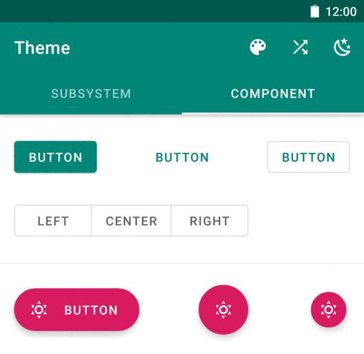

# [Experimental] Theme



`Theme` is an experimental dynamic theme engine for Android.

## WARNING

**`Theme` only works with [`material-components-android 1.1.0`](https://github.com/material-components/material-components-android/releases/tag/1.1.0). Any other version doesn't work.**

**I don't recommend using `Theme` in the production** because the implementation is fragile.

Jetpack Compose supports dynamic theming and is a better alternative(in the future).

## Usage

1. [Try a snapshot from JitPack.](https://jitpack.io/#xyz.aprildown/Theme)
1. Define six theme colors:

    ```XML
    <resources>
        <color name="colorPrimary">#008577</color>
        <color name="colorPrimaryVariant">#00574B</color>
        <color name="colorOnPrimary">#FFFFFF</color>
        <color name="colorSecondary">#D81B60</color>
        <color name="colorSecondaryVariant">#A00037</color>
        <color name="colorOnSecondary">#FFFFFF</color>
    </resources>
    ```

    - **The color resources name must be identical to the names above.**
    - **Color values must be formatted as `#RRGGBB`. Color references won't work** because of [how `TypedArray.getResourceId` works](https://developer.android.com/reference/android/content/res/TypedArray.html#getResourceId(int,%20int)).

1. Add an attribute to your root theme:

    ```XML
    <style name="AppTheme" parent="Theme.MaterialComponents.DayNight.NoActionBar">
        ...
        <!-- Add this line -->
        <item name="viewInflaterClass">xyz.aprildown.theme.ThemeViewInflater</item>
    </style>
    ```

1. In your Application:

    ```Kotlin
    Theme.init(
        context = this,
        themeRes = R.style.AppTheme
    ) {
        // Optional. Provide initial colors here.
        // The usage is same as the code below.
    }
    ```

1. Change colors:

    ```Kotlin
    Theme.edit(this) {
        colorPrimaryRes = R.color.md_amber_500
        colorPrimaryVariantRes = R.color.md_amber_800
        colorOnPrimary = on(colorPrimary)
        colorSecondaryRes = R.color.md_blue_500
        colorSecondaryVariantRes = R.color.md_blue_800
        colorOnSecondary = on(colorSecondary)
        colorStatusBar = colorPrimaryVariant
    }
    ```

    - Variables ending with `Res` expect a `ColorRes`. Other variables expect a `ColorInt`.
    - **After editing, you have to recreate activities in the back stack manually.**

## More Settings

### Tint Status Bar and Navigation Bar

```Kotlin
Theme.tintSystemUi(activity)
```

- Put it in activity's `onCreate`, but if you're using `DrawerLayout`, put it after `DrawerLayout` is inflated(usually it's after `setContentView`).

### Disable Theme

This's useful when you show a `MaterialDatePicker` because `Theme` messes up its colors.

```Kotlin
button.setOnClickListener {
    Theme.get().enabled = false
    MaterialDatePicker.Builder.datePicker()
        .build()
        .apply {
            addOnDismissListener {
                Theme.get().enabled = true
            }
        }
        .show(childFragmentManager, null)
}
```

### Support Custom Views

1. Create a `ThemeInflationDelegate` like [AppComponentsDelegate](/app/src/main/java/xyz/aprildown/theme/app/AppComponentsDelegate.kt).
1. Add it after `Theme`'s initialization:

    ```Kotlin
    Theme.init(...)
    Theme.installDelegates(AppComponentsDelegate())
    ```

## Limitation

- Style `Toolbar` [according to the docs](https://github.com/material-components/material-components-android/blob/master/docs/components/TopAppBar.md#regular-top-app-bar), or the tint doesn't work.
- `Theme` doesn't use any reflection, so it's hard to tint widgets like `TimePicker`.
- `Theme` heavily depends on `material-components-android 1.1.0` internal resources ID, making it doesn't work with 1.0.0, 1.2.0, or later.

## How `Theme` Works

`material-components-android 1.1.0` makes setting attributes programmatically very easy. [ThemeViewInflater](/theme/src/main/java/xyz/aprildown/theme/ThemeViewInflater.kt) extends [MaterialComponentsViewInflater](https://developer.android.com/reference/com/google/android/material/theme/MaterialComponentsViewInflater) and does all retint work. Classes named `***Tint` resolves color attributes from `AttributeSet` and applies new color.

## License

[Apache License 2.0](LICENSE)
